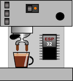

# ESP32resso Machine

This project refactored from the [original ESPressIoT project by Roman Schmit](https://github.com/Schm1tz1/ESPressIoT) originally written for an ESP3866 board with a TSIC sensor. 

This 'fork' ports that code to an ESP32 with a MAX31855 amplified K thermocouple, refactored it to be more object oriented. I also made the webinterface graphicallymore  apealing and used the faster aSyncWebServer and added what could be considered and API. The result is not only eyecandy: the configuration page now has a graph by which you can track what effect your changes have. Mainly for my own fun and to have a project to practice some rusty C++, JavaScript, and HTML/CSS/SVG.

The project covers somewhat advances features for an espresso machine controller. The basic idea was to have reproducible "espresso results" due to temperature regulation and being able to fine-tune. Especially small machines have a low heat capacity and quality suffers a lot from different heat-up-times and high hysteresis in standard temperature switches.

This work is based on Roman's previous work with with IoT, MQTT and his small controller cofcon. As always - take care, you are working with high voltages and you are switching loads up to a few Kilowatts. Please be sure yo know what you are doing, always disconnect and unplug you machine before installing electronics components, choose your components (cables, connectors, sensors, SSR etc.) wisely...

### Acknowledgements

Roman Schmit, some of the code is a literal copy of his, some of it is butchered. All good idea's are his, the errors introduced are mine.

The webpages uses, borrows, or was inspired by the gauge.min.js library from https://canvas-gauges.com/; button.css by Ashley Watson-Nolan from htps://codepen.io/ashleynolan/pen/wBppKzt; 
[D3j library](https://d3js.org/) and the many examples from its community such as Brendan Sudol's way to [make a graph responsive](https://brendansudol.com/writing/responsive-d3).

## Dependencies

### BOM
* Espresso Machine (Gaggic CC, Rancilio Silvia etc.)
* ESP32 dev board (I used  the ESP32 NodeMCU Module WLAN WiFi Development Board met CP2102 )
* a suitable temperature sensor (This code uses the MAX31855 with the
 library)
* a SSR which is capable of switching your heater, has a low trigger threshold and does not draw too much current (otherwise you will toast your ESP8266) I used one by Fotek
* some electronics skills, a soldering iron and some loose parts.

### Software
For development: platformIO on Visual Studio Code MAX with ([MinifyAll](https://marketplace.visualstudio.com/items?itemName=josee9988.minifyall) as a critical extention) was used. 

The code relies on the following libraries:
* [Arduino-PID-Library v1][1] 
* [ArduinoJSON v6][2]
* [Adafruit-MAX31855][3] 
* [ArduinoStreamUtils][4]
* [PubSubClient][5]
* [ESPAsyncWebServer][6]

It includes a local copy of [Gauge.js](https://bernii.github.io/gauge.js/) and downloads [d3j v4](https://d3js.org/) from d3js.org.
## Hardware setup

For the hardware setup I followed the example from [Bnayalivne's
Instructable](https://www.instructables.com/PID-Controlled-Thermostat-Using-ESP32-Applied-to-a/
"Bnayalivne's Instructable page") page. I used[ a
splitter](images/Splitter.jpg "image showing the splitter") to solder
a USB charger to. And the whole circuit I installed in the space
behind the frontplate, in a [small mayonnaise
container](images/ERP32-in-plastic-box.jpg) keep it dry from the drip
plate.

Whilst the Fotek should be able to handle the 3.3 V output from the
GPIO it failed doing so. The small circuit with the transistor, resistor, and the
diode (against flowback) uses the GPIO defined in heater.ino to switch the output from
the 5v voltage pin.
 

Finally, here is a graph of the PID kicking into action.

[1]: https://github.com/br3ttb/Arduino-PID-Library
[2]: https://github.com/bblanchon/ArduinoJson 
[3]: https://github.com/adafruit/Adafruit-MAX31855-library
[4]: https://github.com/bblanchon/ArduinoStreamUtils/
[5]: https://github.com/knolleary/pubsubclient
[6]: https://github.com/me-no-dev/ESPAsyncWebServer

